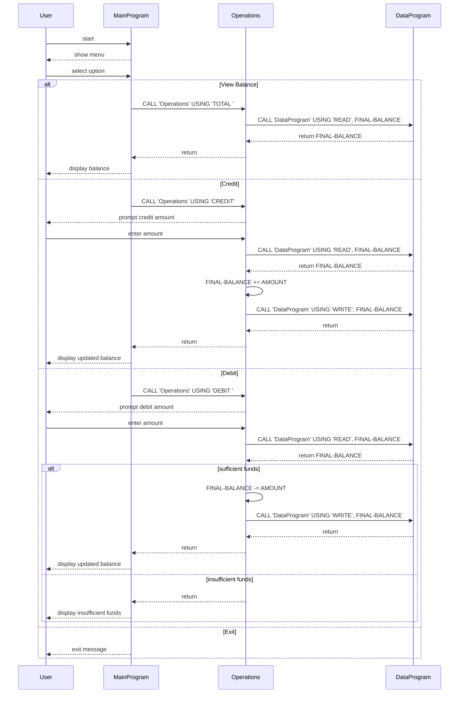

# COBOL Student Account Management (Week 4)

## Overview
This project is a small legacy COBOL-based account management app. It models a student account balance and supports viewing balance, crediting, and debiting funds.

The code is organized in three COBOL programs:
- `main.cob`: user menu and main loop.
- `operations.cob`: business operations (view, credit, debit).
- `data.cob`: in-memory balance persistence simulation.

---

## File Summaries

### `src/cobol/main.cob`
- Program ID: `MainProgram`
- Role: CLI interaction and menu navigation.
- Key behavior:
  - Repeatedly presents options 1-4.
  - Calls `Operations` with arguments:
    - `TOTAL ` for view balance
    - `CREDIT` for adding funds
    - `DEBIT ` for subtracting funds
  - Exits on option 4.

### `src/cobol/operations.cob`
- Program ID: `Operations`
- Role: interprets user command and executes account operations.
- Working variables:
  - `OPERATION-TYPE` (6-char command)
  - `AMOUNT` (for credit/debit input)
  - `FINAL-BALANCE` (starting at `1000.00`)
- Business operations:
  1. `TOTAL `:
     - CALL `DataProgram` USING `READ`, FINAL-BALANCE
     - DISPLAY the current balance.
  2. `CREDIT`:
     - Read input `AMOUNT`
     - Read balance
     - Add amount to balance
     - Write back balance via `DataProgram` WRITE
     - Display new balance.
  3. `DEBIT `:
     - Read input `AMOUNT`
     - Read balance
     - Check `FINAL-BALANCE >= AMOUNT`
       - If yes: subtract, write back, display new balance.
       - If no: display "Insufficient funds for this debit."

### `src/cobol/data.cob`
- Program ID: `DataProgram`
- Role: persistent storage simulation for the account balance.
- Working variables:
  - `STORAGE-BALANCE` (holds current simulated balance, initial `1000.00`)
  - `OPERATION-TYPE` (read/write selector)
- Interface (LINKAGE): `PASSED-OPERATION` and `BALANCE`.
- Behavior:
  - If `READ`: move `STORAGE-BALANCE` to `BALANCE`
  - If `WRITE`: move `BALANCE` to `STORAGE-BALANCE`

---

## Key Business Rules (Student Account)
- Initial balance: `1000.00`.
- Balance can only be changed by `CREDIT` and `DEBIT` operations.
- Debit is only allowed when requested amount is <= current balance.
- Invalid menu choices show an error and re-display main menu.
- The app loops until user selects "Exit" (option 4).
- This implementation uses in-memory variable (`STORAGE-BALANCE`) for persistence as a simulation (no file DB).

---

## Notes
- Operation selector strings include whitespace-sensitive fixed-length values (`TOTAL `, `DEBIT `).
- Naming and command arguments are expected to be exactly 6 characters in `Operations` and `DataProgram`.

---

## Sequence Diagram (Mermaid)

